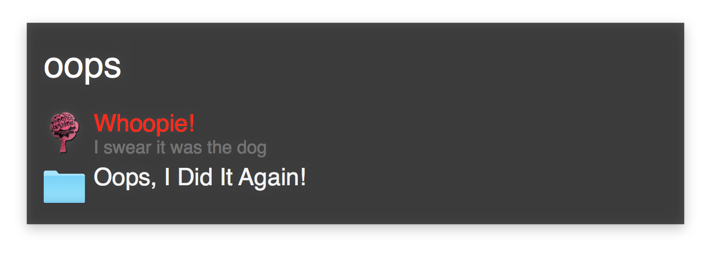

# alfred-whoopie
A port of the infamous Whoopie Cushion OS X dashboard widget to an Alfred workflow

I'm not totally sure why I created a github repo for this; I'm just trying to fit in cuz all the cool kids are doing this.

The only difference between how this behaves compared to the widget is that you don't click the adorable little pootbag, you just type the keyword "oops" instead. 

You can download the [workflow right here](Whoopie.alfredworkflow?raw=true).

---

I reached out to the developer of the original widget and asked if I could port this over to Alfred since I was finally ending the life of my dashboard. This was the only widget left that I hadn't found a replacement for.

You can find the original over at [Jacob’s website](http://www.jacobrath.com/download.html).

And now, without further adoodoo, for historical reference, here is the spark that lit the fire under my pants:

———

Dearest Jacob,

I write with great regret that I'm finally shutting down my OSX dashboard. Most things on it have been replaced with other applications which are rather easy to navigate to with things like Alfred or Spotlight.

The last widget left on my dashboard was your glorious pootbag, the Whoopie Cushion Widget™. I was thinking that it would make for a great Alfred Workflow and was actually quite surprised when I found that there wasn't a replacement already. 

So... 
would you mind if I did a port of your widget over to Alfred? I'd, of course, give all mentions of your work in the notes and read-me's. 

Thanks for giving me so many laughs over the years. :D

— Stagl

—————————————————————————————

Hi Stagl,

It brings me great joy that you enjoyed the Whoopee Cushion Widget so much. I would be more than honored for you to port the pootbag over to Alfred so that it may live on, and bring joy to others as it has us.

Thank you for including me in the software notes and read-me’s. If you could send me a link when it’s finished I would love to install it.

Happy Pooting!!!

Jacob
